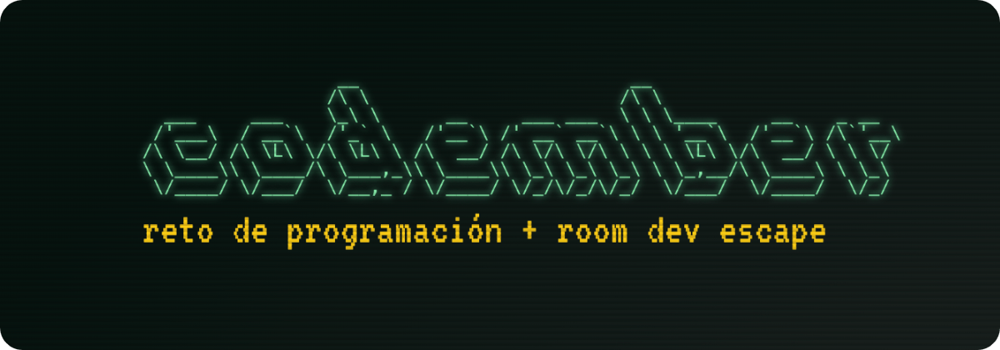

<h1 align="center">
  <div align="center">
    
  </div>
  <br/>
  Soluciones al Codember Challenge 2022 👨‍💻 
</h1>
<br/>

Llego el [Codember 👨‍💻](https://codember.dev), el mejor evento sobre retos de programación creado por [@midudev](https://github.com/midudev).

En este repositorio podrás encontrar mis soluciones a cada uno de los restos, desarrolladas con JavaScript.

## Estructura del repositorio

Cada reto tiene su propio directorio donde podrás encontrar la descripción del reto en el archivo README.md y el script con la solución.

```
.
├── challenge01
│  ├── index.js
│  └── README.md
│
├── challenge02
│  ├── index.js
│  └── README.md
│
├── challenge03
│  ├── index.js
│  └── data.json
│  └── README.md
│
├── challenge04
│  ├── index.js
│  └── README.md
│
├── challenge05
│  ├── index.js
│  └── README.md
│
├── package.json
└── README.md
```

## Probar las soluciones

Si quieres probar mis soluciones haz un `clone` a este repo o descarga el código. Luego ejecuta el siguiente commando segun el challenge que quieras probar:

```
node <challenge_directory>
```

Por ejemplo para probar el primer challenge:

```
node challenge-01
```

## Participa en el Codember

No te quedes sin participar en el evento. Durante el mes de noviembre, cada semana se publica un nuevo reto de programación. Recuerda que si resuelves todos los retos podras ganar un premio sorpresa 🎁🔥. Participa aquí 👉: [codember.dev](https://comdember.dev)
